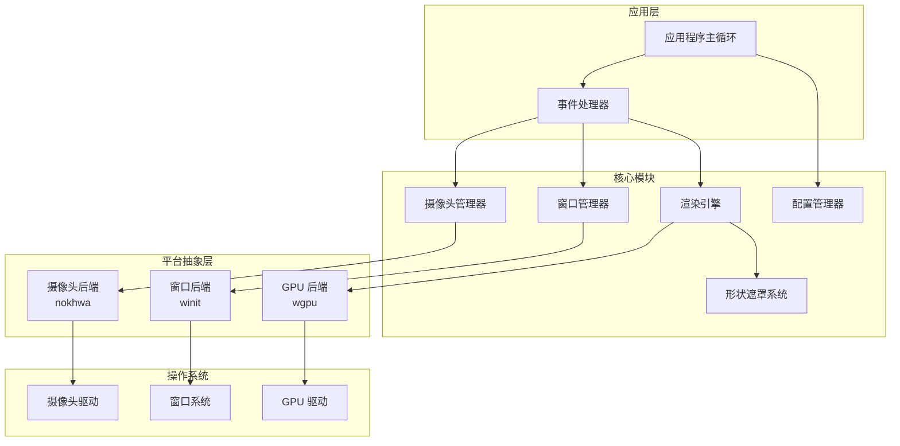
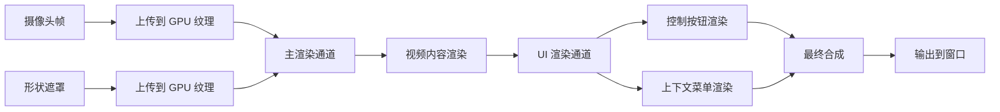

# 设计文档

## 概述

Mira 是一个使用 Rust 开发的跨平台桌面摄像头应用，提供置顶悬浮窗口、形状遮罩和灵活的窗口交互功能。本设计文档描述了 MVP 版本的技术架构和实现方案。

### 设计目标

- **跨平台**: 支持 Windows 和 macOS，使用统一的 API
- **高性能**: 保持 30+ FPS 的视频渲染，低 CPU 和内存占用
- **小体积**: 安装包小于 25 MB，使用静态链接减少依赖
- **可扩展**: 模块化架构，便于后续添加美颜、滤镜等高级功能

### 技术栈选择

基于研究，我们选择以下 Rust 生态系统的核心库：

1. **摄像头捕获**: [nokhwa](https://github.com/l1npengtul/nokhwa) - 跨平台摄像头库，支持 Windows (DirectShow)、macOS (AVFoundation)
2. **窗口管理**: [winit](https://github.com/rust-windowing/winit) - 纯 Rust 窗口管理库，支持置顶窗口和透明背景
3. **GPU 渲染**: [wgpu](https://wgpu.rs/) - 现代 GPU API，支持高性能视频渲染和形状遮罩
4. **图像处理**: [image](https://github.com/image-rs/image) - 图像格式转换和基础处理
5. **配置持久化**: [serde](https://serde.rs/) + [toml](https://github.com/toml-rs/toml) - 配置序列化和反序列化

## 架构

### 系统架构图



### 模块职责

1. **应用程序主循环 (App)**
   - 初始化所有模块
   - 运行事件循环
   - 协调各模块交互
   - 处理应用生命周期

2. **事件处理器 (EventHandler)**
   - 接收和分发窗口事件（鼠标、键盘）
   - 处理拖拽、缩放、旋转逻辑
   - 管理用户交互状态

3. **摄像头管理器 (CameraManager)**
   - 枚举可用摄像头设备
   - 管理摄像头生命周期（打开/关闭）
   - 捕获视频帧
   - 处理设备切换

4. **窗口管理器 (WindowManager)**
   - 创建和管理置顶窗口
   - 处理窗口位置、尺寸、旋转
   - 管理窗口透明度和边界

5. **渲染引擎 (RenderEngine)**
   - 初始化 GPU 渲染管线
   - 将视频帧上传到 GPU
   - 应用形状遮罩
   - 渲染到窗口表面

6. **形状遮罩系统 (ShapeMask)**
   - 定义预设形状（圆形、方形等）
   - 生成形状遮罩纹理
   - 提供形状切换接口

7. **配置管理器 (ConfigManager)**
   - 加载和保存用户配置
   - 管理窗口状态持久化
   - 提供配置访问接口

## 组件和接口

### 1. 摄像头管理器 (CameraManager)

```rust
pub struct CameraManager {
    camera: Option<Camera>,
    devices: Vec<CameraInfo>,
    current_device_index: usize,
}

pub struct CameraInfo {
    pub index: usize,
    pub name: String,
    pub description: String,
}

impl CameraManager {
    /// 创建新的摄像头管理器
    pub fn new() -> Result<Self, CameraError>;
    
    /// 枚举所有可用的摄像头设备
    pub fn enumerate_devices(&mut self) -> Result<Vec<CameraInfo>, CameraError>;
    
    /// 打开指定索引的摄像头设备
    pub fn open_device(&mut self, index: usize) -> Result<(), CameraError>;
    
    /// 关闭当前摄像头设备
    pub fn close_device(&mut self) -> Result<(), CameraError>;
    
    /// 捕获一帧视频
    pub fn capture_frame(&mut self) -> Result<Frame, CameraError>;
    
    /// 获取当前设备信息
    pub fn current_device(&self) -> Option<&CameraInfo>;
}

pub struct Frame {
    pub data: Vec<u8>,
    pub width: u32,
    pub height: u32,
    pub format: PixelFormat,
}

pub enum PixelFormat {
    RGB8,
    RGBA8,
    YUV420,
}

pub enum CameraError {
    NoDeviceFound,
    DeviceInUse,
    PermissionDenied,
    CaptureError(String),
}
```

### 2. 窗口管理器 (WindowManager)

```rust
pub struct WindowManager {
    window: Window,
    position: PhysicalPosition<f64>,
    size: PhysicalSize<u32>,
    rotation: f32,
    is_dragging: bool,
    drag_offset: PhysicalPosition<f64>,
}

impl WindowManager {
    /// 创建新的置顶窗口
    pub fn new(event_loop: &EventLoop<()>) -> Result<Self, WindowError>;
    
    /// 设置窗口位置
    pub fn set_position(&mut self, x: f64, y: f64);
    
    /// 获取窗口位置
    pub fn position(&self) -> PhysicalPosition<f64>;
    
    /// 设置窗口尺寸
    pub fn set_size(&mut self, width: u32, height: u32);
    
    /// 获取窗口尺寸
    pub fn size(&self) -> PhysicalSize<u32>;
    
    /// 设置窗口旋转角度（度数）
    pub fn set_rotation(&mut self, degrees: f32);
    
    /// 获取窗口旋转角度
    pub fn rotation(&self) -> f32;
    
    /// 开始拖拽
    pub fn start_drag(&mut self, cursor_pos: PhysicalPosition<f64>);
    
    /// 更新拖拽位置
    pub fn update_drag(&mut self, cursor_pos: PhysicalPosition<f64>);
    
    /// 结束拖拽
    pub fn end_drag(&mut self);
    
    /// 缩放窗口（百分比）
    pub fn scale(&mut self, factor: f32);
    
    /// 限制窗口在屏幕边界内
    pub fn constrain_to_screen(&mut self, screen_size: PhysicalSize<u32>);
}

pub enum WindowError {
    CreationFailed(String),
    InvalidSize,
    InvalidPosition,
}
```

### 3. 渲染引擎 (RenderEngine)

```rust
/// UI渲染信息
pub struct UIRenderInfo {
    pub show_controls: bool,
    pub window_size: PhysicalSize<u32>,
}

pub struct RenderEngine {
    device: wgpu::Device,
    queue: wgpu::Queue,
    surface: wgpu::Surface,
    pipeline: wgpu::RenderPipeline,
    video_texture: Option<wgpu::Texture>,
    mask_texture: Option<wgpu::Texture>,
    
    // UI 渲染组件
    ui_pipeline: Option<wgpu::RenderPipeline>,
    ui_vertex_buffer: Option<wgpu::Buffer>,
    ui_uniform_buffer: Option<wgpu::Buffer>,
}

impl RenderEngine {
    /// 创建新的渲染引擎
    pub async fn new(window: &Window) -> Result<Self, RenderError>;
    
    /// 上传视频帧到 GPU
    pub fn upload_frame(&mut self, frame: &Frame) -> Result<(), RenderError>;
    
    /// 设置形状遮罩
    pub fn set_mask(&mut self, mask: &ShapeMask) -> Result<(), RenderError>;
    
    /// 渲染一帧（带UI控件）
    pub fn render_with_ui(&mut self, rotation: f32, ui_info: &UIRenderInfo) -> Result<(), RenderError>;
    
    /// 渲染UI控件（关闭和最小化按钮）
    fn render_ui_controls(
        &mut self,
        encoder: &mut wgpu::CommandEncoder,
        view: &wgpu::TextureView,
        ui_info: &UIRenderInfo,
    ) -> Result<(), RenderError>;
    
    /// 渲染单个按钮
    fn render_button(
        &self,
        render_pass: &mut wgpu::RenderPass,
        x: f32, y: f32, size: f32,
        color: [f32; 4],
        symbol: &str,
    );
    
    /// 调整表面大小
    pub fn resize(&mut self, width: u32, height: u32);
}

pub enum RenderError {
    InitializationFailed(String),
    TextureUploadFailed,
    RenderFailed(String),
    UIRenderFailed(String),
}
```

### 4. 形状遮罩系统 (ShapeMask)

```rust
pub struct ShapeMask {
    shape_type: ShapeType,
    width: u32,
    height: u32,
    mask_data: Vec<u8>,
}

pub enum ShapeType {
    Circle,
    Ellipse,
    Rectangle,
    RoundedRectangle { radius: f32 },
    Heart,
}

impl ShapeMask {
    /// 创建新的形状遮罩
    pub fn new(shape_type: ShapeType, width: u32, height: u32) -> Self;
    
    /// 生成遮罩数据（alpha 通道）
    pub fn generate(&mut self);
    
    /// 获取遮罩数据
    pub fn data(&self) -> &[u8];
    
    /// 改变形状类型
    pub fn set_shape(&mut self, shape_type: ShapeType);
    
    /// 调整遮罩尺寸
    pub fn resize(&mut self, width: u32, height: u32);
}

impl ShapeMask {
    /// 生成圆形遮罩
    fn generate_circle(&mut self);
    
    /// 生成椭圆形遮罩
    fn generate_ellipse(&mut self);
    
    /// 生成矩形遮罩
    fn generate_rectangle(&mut self);
    
    /// 生成圆角矩形遮罩
    fn generate_rounded_rectangle(&mut self, radius: f32);
    
    /// 生成心形遮罩
    fn generate_heart(&mut self);
}
```

### 5. 配置管理器 (ConfigManager)

```rust
pub struct ConfigManager {
    config_path: PathBuf,
    config: AppConfig,
}

#[derive(Serialize, Deserialize)]
pub struct AppConfig {
    pub window: WindowConfig,
    pub camera: CameraConfig,
}

#[derive(Serialize, Deserialize)]
pub struct WindowConfig {
    pub position_x: f64,
    pub position_y: f64,
    pub width: u32,
    pub height: u32,
    pub rotation: f32,
    pub shape: String,
}

#[derive(Serialize, Deserialize)]
pub struct CameraConfig {
    pub device_index: usize,
}

impl ConfigManager {
    /// 创建新的配置管理器
    pub fn new() -> Result<Self, ConfigError>;
    
    /// 加载配置
    pub fn load(&mut self) -> Result<AppConfig, ConfigError>;
    
    /// 保存配置
    pub fn save(&self, config: &AppConfig) -> Result<(), ConfigError>;
    
    /// 获取配置文件路径
    pub fn config_path(&self) -> &Path;
}

pub enum ConfigError {
    FileNotFound,
    ParseError(String),
    WriteError(String),
}
```

### 6. 事件处理器 (EventHandler)

```rust
pub struct EventHandler {
    window_manager: WindowManager,
    camera_manager: CameraManager,
    render_engine: RenderEngine,
    shape_mask: ShapeMask,
    last_cursor_pos: PhysicalPosition<f64>,
    
    // UI 控制状态
    is_hovering: bool,
    hover_start_time: std::time::Instant,
    show_controls: bool,
}

impl EventHandler {
    /// 创建新的事件处理器
    pub fn new(
        window_manager: WindowManager,
        camera_manager: CameraManager,
        render_engine: RenderEngine,
        shape_mask: ShapeMask,
    ) -> Self;
    
    /// 处理窗口事件
    pub fn handle_window_event(&mut self, event: &WindowEvent);
    
    /// 处理鼠标按下事件
    fn handle_mouse_press(&mut self, button: MouseButton, position: PhysicalPosition<f64>);
    
    /// 处理鼠标释放事件
    fn handle_mouse_release(&mut self, button: MouseButton);
    
    /// 处理鼠标移动事件
    fn handle_mouse_move(&mut self, position: PhysicalPosition<f64>);
    
    /// 处理鼠标滚轮事件
    fn handle_mouse_wheel(&mut self, delta: MouseScrollDelta, modifiers: ModifiersState);
    
    /// 处理窗口调整大小事件
    fn handle_resize(&mut self, size: PhysicalSize<u32>);
    
    /// 渲染一帧
    pub fn render_frame(&mut self) -> Result<(), String>;
    
    /// 显示右键上下文菜单
    fn show_context_menu(&mut self, position: PhysicalPosition<f64>);
}
```

## 数据模型

### 应用状态

```rust
pub struct AppState {
    pub window_state: WindowState,
    pub camera_state: CameraState,
    pub render_state: RenderState,
}

pub struct WindowState {
    pub position: (f64, f64),
    pub size: (u32, u32),
    pub rotation: f32,
    pub is_dragging: bool,
}

pub struct CameraState {
    pub current_device: Option<usize>,
    pub available_devices: Vec<CameraInfo>,
    pub is_capturing: bool,
}

pub struct RenderState {
    pub current_shape: ShapeType,
    pub fps: f32,
    pub frame_count: u64,
}
```

### 配置文件格式

配置文件使用 TOML 格式存储在用户目录：

```toml
[window]
position_x = 100.0
position_y = 100.0
width = 400
height = 400
rotation = 0.0
shape = "Circle"

[camera]
device_index = 0
```

## 渲染管线

### GPU 渲染流程



### 着色器设计

**主视频着色器** (shader.wgsl):
```rust
// 顶点着色器 - 处理视频内容的旋转变换
fn vs_main(input: VertexInput, rotation: f32) -> VertexOutput {
    let cos_r = cos(rotation);
    let sin_r = sin(rotation);
    let rotated_x = input.position.x * cos_r - input.position.y * sin_r;
    let rotated_y = input.position.x * sin_r + input.position.y * cos_r;
    
    return VertexOutput {
        position: vec4(rotated_x, rotated_y, 0.0, 1.0),
        tex_coords: input.tex_coords,
    };
}

// 片段着色器 - 应用形状遮罩
fn fs_main(input: FragmentInput) -> vec4<f32> {
    let video_color = sample(video_texture, input.tex_coords);
    let mask_alpha = sample(mask_texture, input.tex_coords).a;
    return vec4(video_color.rgb, video_color.a * mask_alpha);
}
```

**UI 着色器** (ui_shader.wgsl):
```rust
// UI 顶点着色器 - 处理 2D UI 元素
fn ui_vs_main(input: UIVertexInput) -> UIVertexOutput {
    // 将像素坐标转换为 NDC 坐标
    let ndc_x = (input.position.x / window_width) * 2.0 - 1.0;
    let ndc_y = 1.0 - (input.position.y / window_height) * 2.0;
    
    return UIVertexOutput {
        position: vec4(ndc_x, ndc_y, 0.0, 1.0),
        color: input.color,
    };
}

// UI 片段着色器 - 渲染半透明 UI 元素
fn ui_fs_main(input: UIVertexInput) -> vec4<f32> {
    return input.color; // 直接使用顶点颜色，支持透明度
}
```

### 形状遮罩生成算法

**圆形遮罩**:
```rust
// 伪代码
fn generate_circle(width: u32, height: u32) -> Vec<u8> {
    let center_x = width / 2;
    let center_y = height / 2;
    let radius = min(center_x, center_y);
    
    let mut mask = vec![0u8; (width * height) as usize];
    
    for y in 0..height {
        for x in 0..width {
            let dx = x as f32 - center_x as f32;
            let dy = y as f32 - center_y as f32;
            let distance = sqrt(dx * dx + dy * dy);
            
            if distance <= radius as f32 {
                mask[(y * width + x) as usize] = 255; // 完全不透明
            } else {
                mask[(y * width + x) as usize] = 0;   // 完全透明
            }
        }
    }
    
    return mask;
}
```

**心形遮罩**:
```rust
// 伪代码
// 使用心形参数方程: x = 16*sin^3(t), y = 13*cos(t) - 5*cos(2t) - 2*cos(3t) - cos(4t)
fn generate_heart(width: u32, height: u32) -> Vec<u8> {
    let center_x = width / 2;
    let center_y = height / 2;
    let scale = min(width, height) as f32 / 40.0;
    
    let mut mask = vec![0u8; (width * height) as usize];
    
    for y in 0..height {
        for x in 0..width {
            let px = (x as f32 - center_x as f32) / scale;
            let py = -(y as f32 - center_y as f32) / scale;
            
            // 检查点是否在心形内部
            if is_inside_heart(px, py) {
                mask[(y * width + x) as usize] = 255;
            }
        }
    }
    
    return mask;
}

fn is_inside_heart(x: f32, y: f32) -> bool {
    // 心形隐式方程
    let x2 = x * x;
    let y2 = y * y;
    return (x2 + y2 - 1).pow(3) - x2 * y2 * y <= 0.0;
}
```

## 正确性属性

*属性是一个特征或行为，应该在系统的所有有效执行中保持为真——本质上是关于系统应该做什么的形式化陈述。属性是人类可读规范和机器可验证正确性保证之间的桥梁。*

### 摄像头管理属性

**属性 1: 设备枚举完整性**
*对于任何* 系统状态，枚举摄像头设备应该返回所有可用设备的完整列表，且列表中的每个设备都包含有效的名称和描述信息。
**验证需求: 1.1, 1.2**

**属性 2: 设备激活后可捕获**
*对于任何* 有效的摄像头设备索引，成功激活该设备后，应该能够捕获至少一帧视频数据。
**验证需求: 1.3**

**属性 3: 设备错误处理**
*对于任何* 不可用或被占用的摄像头设备，尝试打开该设备应该返回明确的错误类型（NoDeviceFound、DeviceInUse 或 PermissionDenied）。
**验证需求: 1.4**

**属性 4: 设备切换一致性**
*对于任何* 两个有效的摄像头设备，从设备 A 切换到设备 B 后，当前激活的设备应该是设备 B，且设备 A 应该被释放。
**验证需求: 1.5**

**属性 5: 设备资源释放**
*对于任何* 已打开的摄像头设备，关闭该设备后，应该能够被其他应用程序访问（资源已释放）。
**验证需求: 7.2**

### 窗口管理属性

**属性 6: 窗口置顶不变性**
*对于任何* 窗口状态，摄像头窗口的置顶标志应该始终为真。
**验证需求: 2.2**

**属性 7: 窗口透明度支持**
*对于任何* 创建的摄像头窗口，窗口应该支持透明背景（透明度标志为真）。
**验证需求: 2.6**

**属性 8: 窗口可见性**
*对于任何* 激活的摄像头设备，应该存在一个对应的可见窗口。
**验证需求: 2.1**

### 形状遮罩属性

**属性 9: 形状遮罩应用**
*对于任何* 预设形状类型，应用该形状后，当前遮罩的形状类型应该与选择的形状类型一致。
**验证需求: 3.2**

**属性 10: 遮罩外部透明性**
*对于任何* 形状遮罩和任何在形状外部的像素坐标，该像素的 alpha 值应该为 0（完全透明）。
**验证需求: 3.5**

**属性 11: 遮罩尺寸自适应**
*对于任何* 窗口尺寸变化，形状遮罩的宽度和高度应该与新的窗口尺寸匹配。
**验证需求: 3.6**

### 窗口交互属性

**属性 12: 拖拽状态转换**
*对于任何* 窗口状态，按下鼠标左键应该将拖拽标志设置为真，释放鼠标左键应该将拖拽标志设置为假。
**验证需求: 4.1, 4.3**

**属性 13: 拖拽位置跟随**
*对于任何* 处于拖拽模式的窗口和任何鼠标位置序列，窗口位置应该跟随鼠标移动（考虑拖拽偏移量）。
**验证需求: 4.2**

**属性 14: 窗口边界约束**
*对于任何* 窗口位置，如果该位置会导致窗口超出屏幕边界，则约束后的位置应该确保至少 20% 的窗口区域在屏幕内。
**验证需求: 4.5**

**属性 15: 窗口缩放比例**
*对于任何* 窗口尺寸和滚轮方向（向上或向下），缩放后的窗口尺寸应该是原尺寸的 110%（向上）或 90.9%（向下），且宽高比保持不变。
**验证需求: 5.1, 5.2, 5.3, 5.6**

**属性 16: 窗口旋转增量**
*对于任何* 窗口旋转角度和滚轮方向（向上或向下），旋转后的角度应该是原角度加上 15 度（向上）或减去 15 度（向下），且角度值在 0-360 度范围内。
**验证需求: 6.1, 6.2, 6.3, 6.4**

**属性 17: 旋转角度对齐**
*对于任何* 旋转角度，如果该角度在 0°±5°、90°±5°、180°±5° 或 270°±5° 范围内，则应该自动对齐到最近的精确角度（0°、90°、180° 或 270°）。
**验证需求: 6.6**

### 配置持久化属性

**属性 18: 配置往返一致性**
*对于任何* 有效的应用配置（窗口位置、尺寸、旋转角度、形状类型、摄像头设备索引），保存配置然后加载配置应该得到等价的配置对象。
**验证需求: 7.3, 7.4, 7.6**

### 错误处理属性

**属性 19: 错误日志记录**
*对于任何* 系统错误（摄像头错误、窗口错误、渲染错误、配置错误），应该在日志文件中存在对应的错误记录。
**验证需求: 8.6**

**属性 20: 捕获失败重试**
*对于任何* 视频流捕获失败的情况，系统应该记录错误日志并尝试重新连接摄像头设备。
**验证需求: 8.4**

### 内存管理属性

**属性 21: 无内存泄漏**
*对于任何* 重复执行的操作序列（打开/关闭设备、切换形状、拖拽窗口），执行 N 次后的内存占用应该与执行 1 次后的内存占用相近（允许合理的缓存增长）。
**验证需求: 10.6**

### UI 控制属性

**属性 22: UI 控件悬浮显示**
*对于任何* 鼠标进入窗口区域的事件，如果鼠标在窗口内停留超过 500 毫秒，则应该显示控制按钮。
**验证需求: 12.1, 12.2**

**属性 23: UI 控件点击响应**
*对于任何* 在控制按钮区域内的鼠标点击事件，系统应该执行相应的操作（关闭或最小化）。
**验证需求: 12.5, 12.6**

**属性 24: UI 控件视觉渲染**
*对于任何* 显示控制按钮的状态，应该在窗口右上角渲染可见的按钮图形（红色关闭按钮和灰色最小化按钮）。
**验证需求: 12.3, 12.4, 12.8, 12.9**

**属性 25: 右键菜单显示**
*对于任何* 在窗口区域内的右键点击事件，系统应该在鼠标位置附近显示上下文菜单。
**验证需求: 13.1, 13.9**

**属性 26: 右键菜单功能执行**
*对于任何* 上下文菜单项的选择，系统应该执行相应的功能并隐藏菜单。
**验证需求: 13.6, 13.7**

### 形状差异化属性

**属性 27: 椭圆形与圆形差异**
*对于任何* 非正方形的窗口尺寸，椭圆形遮罩应该明显不同于圆形遮罩，椭圆形应该适应窗口宽高比。
**验证需求: 14.1, 14.2**

**属性 28: 心形大小适当性**
*对于任何* 窗口尺寸，心形遮罩应该占据窗口面积的至少 60%，确保清晰可见。
**验证需求: 14.4, 14.5**

**属性 29: 形状边缘平滑性**
*对于任何* 形状遮罩，边缘应该平滑无锯齿，提供良好的视觉质量。
**验证需求: 14.7**

### 拖拽性能属性

**属性 30: 拖拽超低延迟**
*对于任何* 拖拽过程中的鼠标移动事件，系统应该在 8 毫秒内更新窗口位置。
**验证需求: 15.1, 15.2**

**属性 31: 拖拽位置精度**
*对于任何* 拖拽操作，窗口位置应该与鼠标位置完全同步，位置变化精度应该达到 0.05 像素。
**验证需求: 15.3**

**属性 32: 拖拽性能隔离**
*对于任何* 拖拽操作，不应该影响视频渲染帧率，系统应该保持 30+ FPS。
**验证需求: 15.6**


## 错误处理

### 错误类型层次

```rust
pub enum MiraError {
    Camera(CameraError),
    Window(WindowError),
    Render(RenderError),
    Config(ConfigError),
}

impl std::fmt::Display for MiraError {
    fn fmt(&self, f: &mut std::fmt::Formatter) -> std::fmt::Result {
        match self {
            MiraError::Camera(e) => write!(f, "摄像头错误: {}", e),
            MiraError::Window(e) => write!(f, "窗口错误: {}", e),
            MiraError::Render(e) => write!(f, "渲染错误: {}", e),
            MiraError::Config(e) => write!(f, "配置错误: {}", e),
        }
    }
}
```

### 错误处理策略

**摄像头错误**:
- **NoDeviceFound**: 显示友好提示"未检测到摄像头设备，请连接摄像头后重试"
- **DeviceInUse**: 提示"摄像头正被其他应用使用，请关闭占用摄像头的应用"
- **PermissionDenied**: 提示"摄像头访问权限被拒绝，请在系统设置中允许 Mira 访问摄像头"
- **CaptureError**: 记录详细错误日志，尝试重新连接设备（最多 3 次）

**窗口错误**:
- **CreationFailed**: 记录错误日志，显示"窗口创建失败"并退出应用
- **InvalidSize**: 自动调整到有效尺寸范围（100x100 到屏幕的 80%）
- **InvalidPosition**: 自动调整到屏幕边界内

**渲染错误**:
- **InitializationFailed**: 记录错误日志，显示"GPU 初始化失败，请更新显卡驱动"并退出
- **TextureUploadFailed**: 跳过当前帧，继续渲染下一帧
- **RenderFailed**: 记录错误日志，尝试重新初始化渲染管线

**配置错误**:
- **FileNotFound**: 使用默认配置创建新配置文件
- **ParseError**: 使用默认配置并备份损坏的配置文件
- **WriteError**: 记录错误日志，继续运行但不保存配置

### 日志系统

使用 [log](https://docs.rs/log/) 和 [env_logger](https://docs.rs/env_logger/) 实现日志记录：

```rust
// 日志级别
// ERROR: 严重错误，可能导致功能不可用
// WARN:  警告信息，功能可用但可能有问题
// INFO:  重要信息，如设备切换、配置加载
// DEBUG: 调试信息，如帧率、性能指标
// TRACE: 详细跟踪信息，如每帧渲染细节

// 日志文件位置
// Windows: %APPDATA%\Mira\logs\mira.log
// macOS:   ~/Library/Application Support/Mira/logs/mira.log
```

### 资源清理

使用 RAII（Resource Acquisition Is Initialization）模式确保资源正确释放：

```rust
impl Drop for CameraManager {
    fn drop(&mut self) {
        if let Some(camera) = &mut self.camera {
            // 确保摄像头设备被释放
            let _ = camera.stop_stream();
        }
        log::info!("摄像头管理器已清理");
    }
}

impl Drop for RenderEngine {
    fn drop(&mut self) {
        // GPU 资源会自动释放（wgpu 的 Drop 实现）
        log::info!("渲染引擎已清理");
    }
}
```

## 测试策略

### 双重测试方法

Mira 采用单元测试和基于属性的测试相结合的方法，确保全面的代码覆盖和正确性验证。

**单元测试**:
- 验证具体示例和边缘情况
- 测试错误条件和异常处理
- 测试组件之间的集成点
- 使用 Rust 内置的 `#[test]` 和 `#[cfg(test)]`

**基于属性的测试**:
- 验证跨所有输入的通用属性
- 通过随机化实现全面的输入覆盖
- 使用 [quickcheck](https://docs.rs/quickcheck/) 库
- 每个属性测试运行至少 100 次迭代

### 测试库选择

- **单元测试框架**: Rust 内置测试框架
- **基于属性的测试**: [quickcheck](https://docs.rs/quickcheck/) - Rust 生态中成熟的 PBT 库
- **模拟库**: [mockall](https://docs.rs/mockall/) - 用于模拟摄像头设备和窗口系统

### 测试组织

```
src/
├── camera/
│   ├── mod.rs
│   ├── manager.rs
│   └── tests.rs          # 单元测试
├── window/
│   ├── mod.rs
│   ├── manager.rs
│   └── tests.rs          # 单元测试
├── render/
│   ├── mod.rs
│   ├── engine.rs
│   └── tests.rs          # 单元测试
└── shape/
    ├── mod.rs
    ├── mask.rs
    └── tests.rs          # 单元测试

tests/
├── property_tests.rs     # 所有基于属性的测试
└── integration_tests.rs  # 集成测试
```

### 基于属性的测试配置

每个属性测试必须：
1. 运行至少 100 次迭代（通过 `QuickCheck::new().tests(100)`）
2. 使用注释标记引用设计文档中的属性
3. 标记格式: `// Feature: mira, Property N: [属性描述]`

示例：
```rust
#[test]
fn property_device_enumeration_completeness() {
    // Feature: mira, Property 1: 设备枚举完整性
    QuickCheck::new()
        .tests(100)
        .quickcheck(prop_enumerate_devices_returns_all as fn() -> bool);
}

fn prop_enumerate_devices_returns_all() -> bool {
    // 属性测试实现
    true
}
```

### 测试覆盖目标

- **单元测试**: 覆盖所有公共 API 和关键私有函数
- **属性测试**: 实现设计文档中定义的所有 21 个正确性属性
- **集成测试**: 测试完整的用户工作流（启动 → 选择设备 → 切换形状 → 拖拽 → 关闭）
- **边缘情况**: 最小/最大窗口尺寸、边界旋转角度、空设备列表

### 模拟策略

由于摄像头和窗口系统依赖硬件和操作系统，我们使用模拟对象进行测试：

```rust
// 模拟摄像头设备
pub struct MockCamera {
    frames: Vec<Frame>,
    current_frame: usize,
}

impl MockCamera {
    pub fn new(frame_count: usize) -> Self {
        // 生成模拟帧
        let frames = (0..frame_count)
            .map(|_| Frame::new_test_frame(640, 480))
            .collect();
        
        Self {
            frames,
            current_frame: 0,
        }
    }
    
    pub fn capture_frame(&mut self) -> Result<Frame, CameraError> {
        if self.current_frame < self.frames.len() {
            let frame = self.frames[self.current_frame].clone();
            self.current_frame += 1;
            Ok(frame)
        } else {
            Err(CameraError::CaptureError("No more frames".to_string()))
        }
    }
}
```

### 性能测试

虽然性能要求（30 FPS、内存占用等）不在单元测试范围内，但我们会创建独立的性能基准测试：

```rust
// benches/performance.rs
use criterion::{black_box, criterion_group, criterion_main, Criterion};

fn benchmark_frame_rendering(c: &mut Criterion) {
    c.bench_function("render_frame", |b| {
        b.iter(|| {
            // 渲染一帧的基准测试
        });
    });
}

criterion_group!(benches, benchmark_frame_rendering);
criterion_main!(benches);
```

使用 [criterion](https://docs.rs/criterion/) 库进行性能基准测试，确保：
- 帧渲染时间 < 33ms（30 FPS）
- 形状遮罩切换时间 < 100ms
- 内存占用稳定（无泄漏）

### 持续集成

测试应该在 CI/CD 管道中自动运行：
- 每次提交运行所有单元测试和属性测试
- 每日运行完整的集成测试和性能基准测试
- 使用 GitHub Actions 或类似的 CI 工具
- 测试覆盖率目标: 80% 以上
